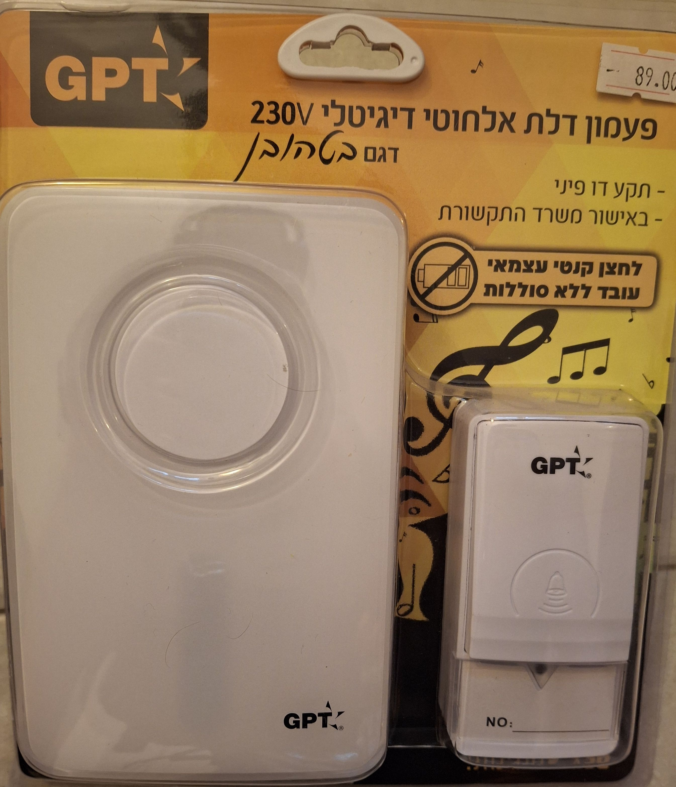
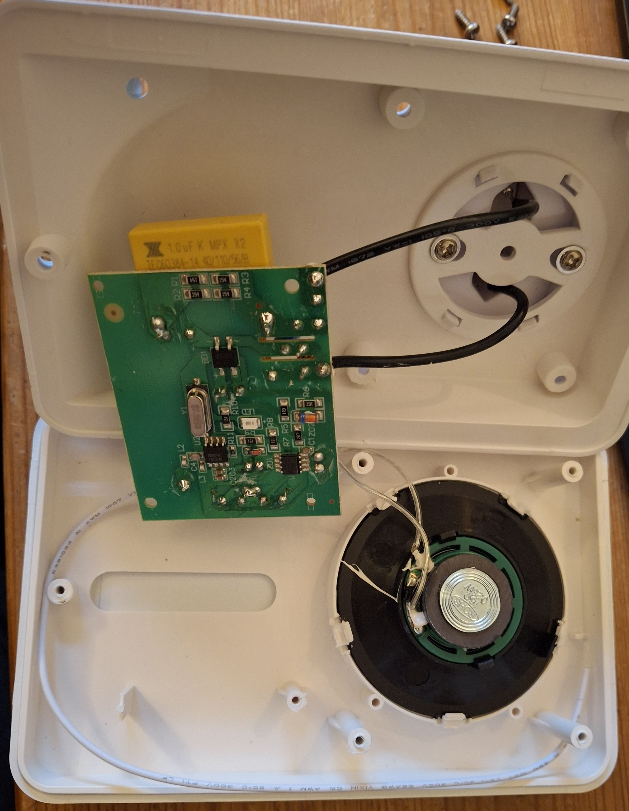
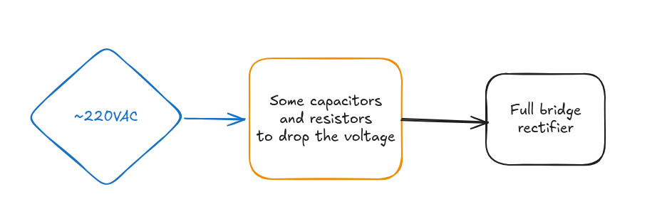
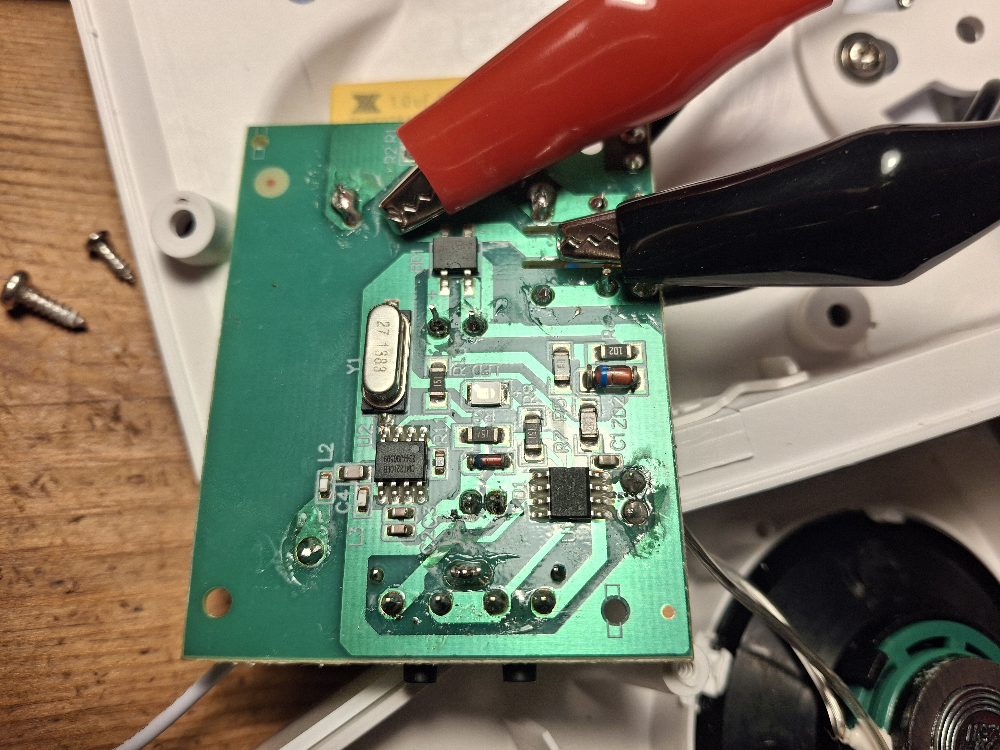
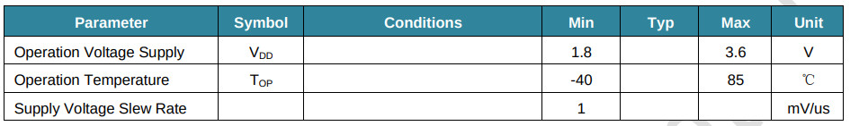
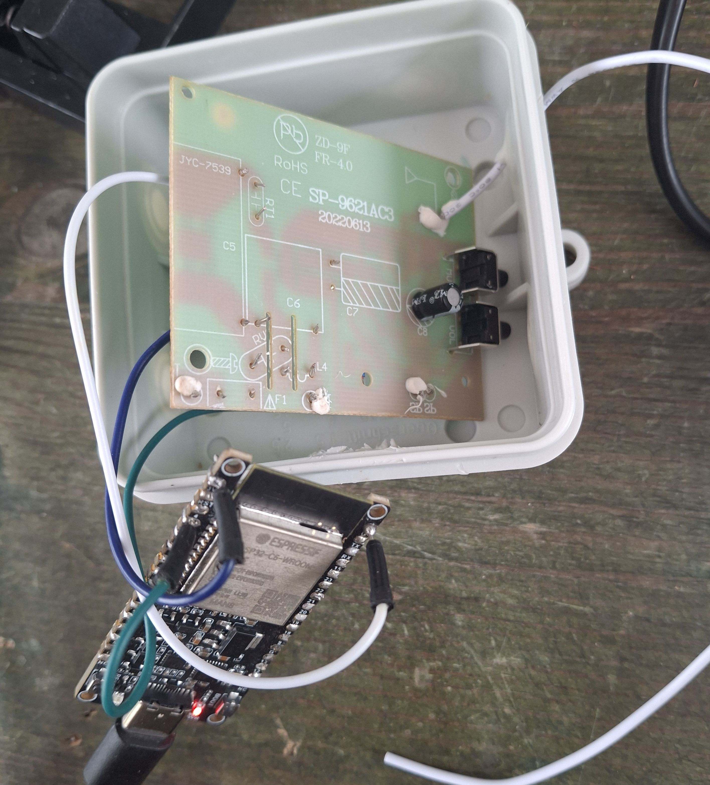
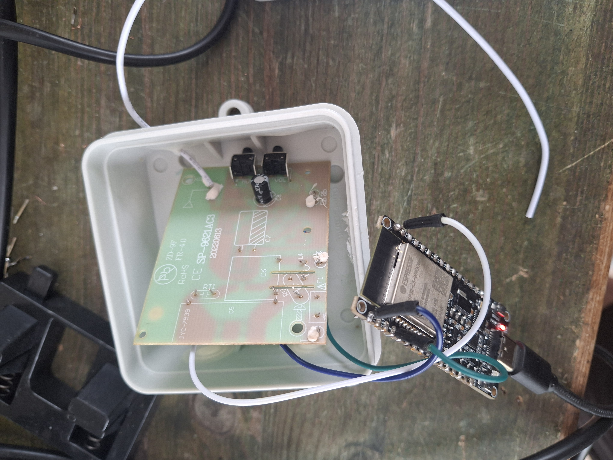
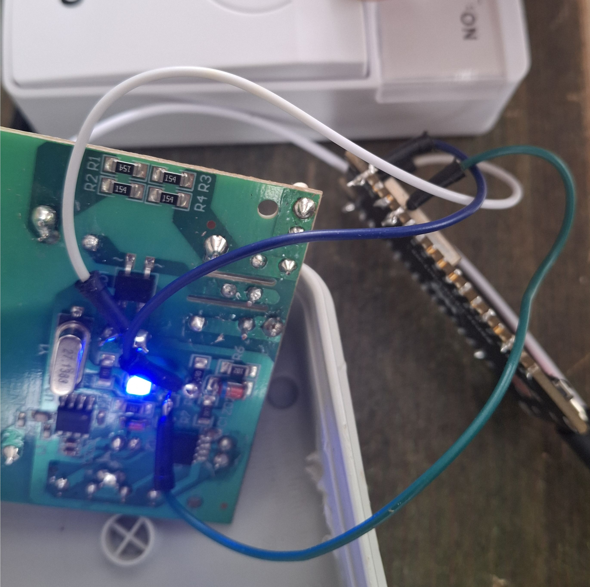
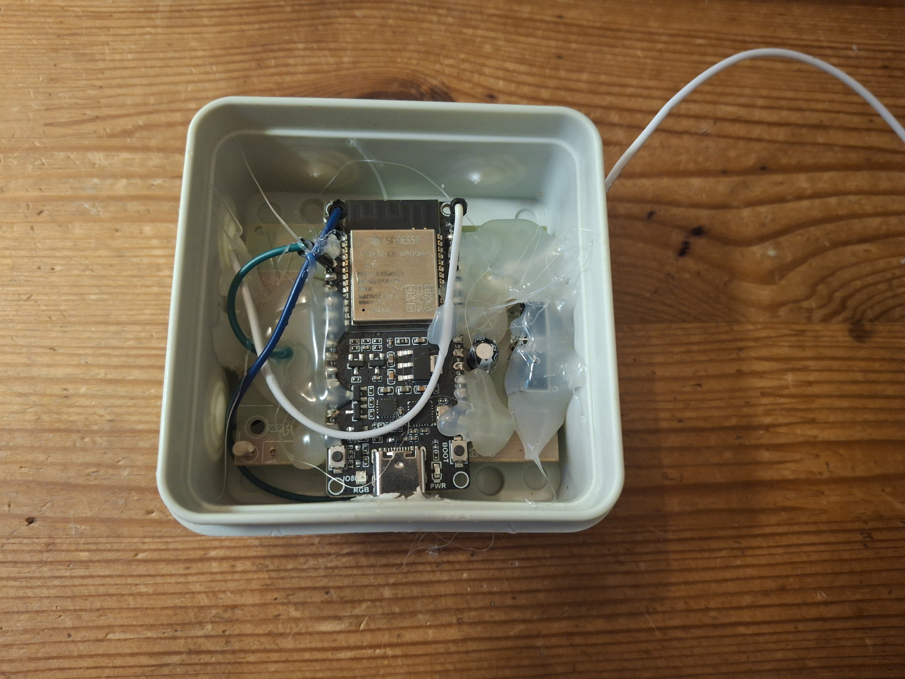

# Integration of SP-9621T AC doorbell with MQTT+NodeRED

## Background story

I recently bought the "Doorbell wireless SP-9621T AC" from a local shop
in my town - it only was about 80 NIS.

I decided to purchase it because I needed to replace my "old" doorbell
which I modified as well to connect via this [clever hack](https://github.com/supercomputer7/mqtt-sip-doorbell-subscriber) I found.

I still have VoIP phones around the house, which I'd want to take advantage of
and use them to make a nice sound when someone is ringing the bell - so
that part should stay and I'd not need to modify anything there.

## A local brand for international (?) product

The label on the packaging says the local brand is GPT. I saw that brand
on A/C remote controls as well, so it must be a company that imports goods
from many manufacturers and put a label on it.

Since I can't really find anything useful on this product besides whatever
is being written on the packaging, I went on to examine it myself.

The product I bought can be found [here](https://www.domino.com.ge/en/products-en/electrical-goods-en/electric-accessories-en/doorbells-en/doorbell-wireless-sp-9621t-ac/) as well.

## What's inside the package

There are only 2 components - the button and a receiver.
The receiver is plugged right into a 220VAC outlet. The button should placed
outside the house near the front door, so people can click on it.

The button click is pretty rough, but that is justified by the fact that
by putting the required amount of temoorary pressure, the necessary energy
is being put to power on a small RF transmitter which transmits the right
code to be received in the receiver part of the system.

## RF, electronics, and more in depth explanation

This section is completely optional. I like to investigate how these "ordinary"
household products are actually working and observe the engineering effort
that was put into such product.

**It should be noted, that since the receiver is plugged into live mains (220-230VAC)
you should never open and touch this while this is plugged into a mains outlet!**

I carefully opened the receiver part by taking out 5 screws.
It looked like this:

Then I unscrewed 2 more, to see the bottom side of the board -
there are 2 ICs and what seems like a full bridge rectifier.

The first IC I looked on has a text of CMT2210LB - which is a low power RF receiver.
The modulation is interesting as well - it's an OOK receiver (On-Off Key) - such
modulation is presumably very efficient for things like doorbells.

The second IC, no matter with how much light or using optic lens, I couldn't see any
text on it. However, it is connected to the loudspeaker that plays a song when the
doorbell is "ringing". I'd assume that it is at the very least a loudspeaker amplifier IC,
but it might have other components like decoding digital signals into analog ones (i.e. DAC).

The power circuity is also very simple - which is a fact I actually dislike because
it does seem cheap and risky.

This should be the first thing I worry about and I'd want to replace
it soon.

## Powering up safely

In the previous section I said I dislike the power circuit - I should emphasize that
this is a cheap circuit, so the cost "justifies" the decision to build a transformerless and also
a non-switch-mode power circuit like this.

I **carefully** plugged the receiver into mains voltage and examined the most interesting part
of the circuit which is the output of the full bridge rectifier - my multimeter says it has DC voltage of around 4.45V.

I decided to try to power the **input** of the full bridge rectifier with stable 5V.

And it worked! I got about 3.5V on the output side of the full bridge rectifier, which seems correct
because if we assume that the diode bridge is made with diodes that have voltage drop of 0.7V, then the
equation seems to work perfectly fine.

As for why it works - I looked at the datasheet of the OOK receiver before I applied the voltage,
just to see what is the max voltage being allowd:

.

I also have seen, while powering up from mains, that there's a solid 3.3V on the VDD
rail to that OOK receiver, and that happens because of a presumably 3.3V zener diode.

Now that it all works with no mains voltage hazard, I can move on to hook this into a ESP32 board :)

## Powering up safely & efficiently

Even though the mentioned approach so far worked just fine, I was reluctant to try
not using the bridge diode. That diode, together with the zener diodes, add only
a complexity that is not necessary. Also, I could salvage some of these parts for
future projects.

I used my bench power supply, being set to 3.3V, and plugged it right **after** the
the diode bridge, and clicked on the remote button and it worked as well, as I saw a flashing
LED output, which is all I need to continue :)

I will use an ESP32 board for this project, which has a USB Type-C input, and LDO for converting a 5V
input into 3.3V output - which I will happily use to power the receiver board.

## A new box for the receiver part

The old box for the receiver part has a plug to mains outlet, which I decided to abandon.

I found a nice box (of 75mm x 75mm x 37mm - length x width x height) in a local hardware store, so I bought
it for the sake of having a better enclosure for this product.

When taking the big capacitor and some other unnecessary components of the 220V transformerless power supply
circuit, I managed to make it all fit nicely with an ESP32C6 devboard I picked for this project.

## ESP32 Wi-Fi & MQTT integration

I'd want to connect the receiver into my Wi-Fi network, and make it so it will send
messages in an MQTT channel when someone wants to ring the bell.

Looking at the board, there are 2 options as an indication of ringing -
1. Using the loudspeaker output
2. Using the LED

The loudspeaker is not really an "easy" source, because we will need
to use an ADC to check the analog waveform.

However, the LED is a "digital" indication because it doesn't use
an analog waveform - only HIGH or LOW voltages are applied, which could be easily
detected by a microcontroller like an ESP32.

We don't even need a serious decoding logic in our code - since there's a GPIO output
going HIGH when the LED should be ON (the output is connected to the anode) we simply
need to detect a rising edge, idle out a bit, and if it continues, then consider it "ON"
and then idle again, doing so in a loop.

I already wrote some Arduino code using ChatGPT which I could import for this project -
the code can be modified, but I just asked the bot to regenerate it, and it did so almost quite well.

It just had a minor, stupid bug that it had a delay (sleeping) for amount of specified seconds I asked it in the prompt
instead of sleeping only when the button is clicked.

As for putting the proper delay, so this won't spit out tons of RING messages, I simply started off without any delay,
opened Wireshark and took a network capture with a filter of MQTT messages - it showed up to send messages for roughly 5
seconds each time I clicked on the button, so I decided to put a delay of 5 seconds.

## Testing

Now is time to put this to test!

Here I clicked on it and saw the blue LED flickering:

When I configured the credentials and the MQTT topic to my own setup, I saw RING messages in the terminal :)

## Results!

